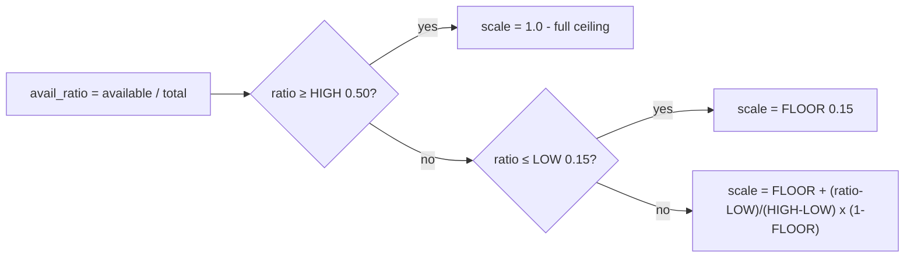
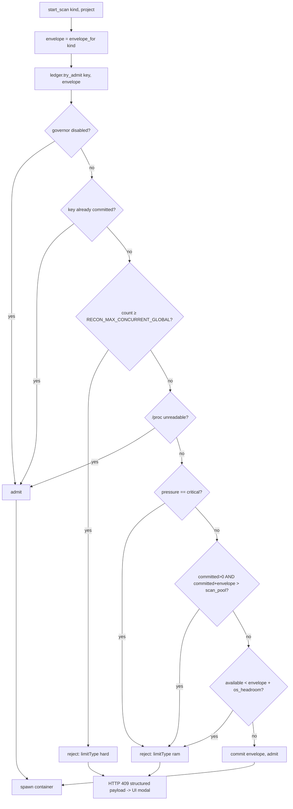
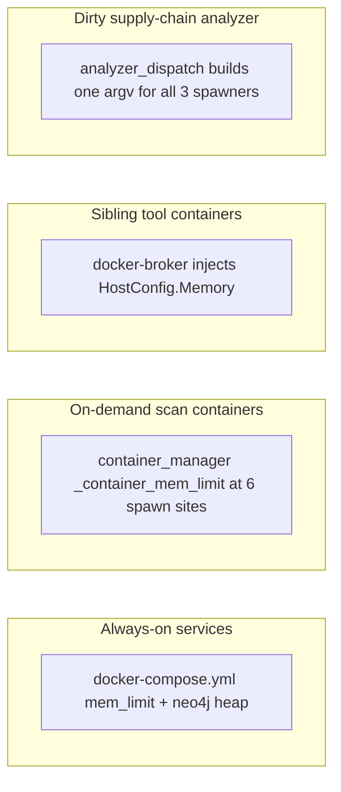
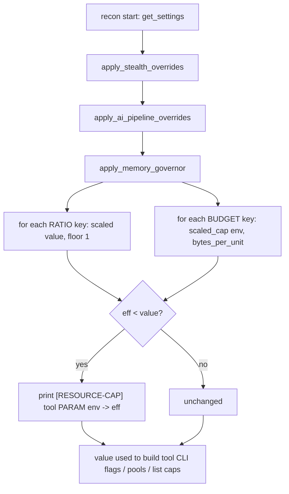

# Memory Governor (RAM Management) - Technical Reference

This document explains, end to end, how WhiteHat keeps a single host from running out
of RAM while many recon scans and agent chat sessions run at once. It is written for
an engineer who needs to understand, operate, debug, or extend the system. It starts
with the problem and the core model, then dives into every component, data structure,
decision, and environment variable. All diagrams are Mermaid (no colour, so they read
correctly in both light and dark themes).

---

## 1. The problem, in one paragraph

WhiteHat runs everything on one host: Postgres, Neo4j, the agent, the orchestrator, the
webapp, and, on demand, up to a dozen recon scan containers, each of which spawns its
own sibling tool containers (naabu, httpx, katana, nuclei, gau, …). Historically none of
this was memory-aware: every concurrency, parallelism, worker, and `*_MAX_*` list value
was a fixed number, no container had a `mem_limit`, and nothing read how much RAM was
free. A single runaway crawl (`KATANA_MAX_URLS=300000`) or six parallel scans could
exhaust host RAM and trigger the kernel OOM killer, which picks a *random* victim, often
Postgres or Neo4j, taking the whole stack down. The **memory governor** is the subsystem
that makes RAM a first-class, actively-managed resource so this can never happen.

---

## 2. Core concept: the dual-cap model

Every RAM-relevant knob keeps the value you configure (the **hard ceiling**) and gains a
**second, dynamic cap** computed at runtime from the memory actually available. The
effective value is always the smaller of the two, so the dynamic cap can only ever
throttle **down** under pressure, never above your ceiling.

```
effective = min( configured_ceiling , dynamic_cap(available_ram) )
```

There are two dynamic models, chosen by *what one unit of the knob is*:

| Model | Applies to | Formula |
|---|---|---|
| **RATIO** | in-process concurrency: threads, `-c`/`-t`, thread-pool widths | `clamp( round(value × scale), floor, value )` |
| **BYTE-BUDGET** | anything that costs real megabytes: a process, a container, a session, or an in-memory `*_MAX_*` list | `clamp( available × fraction ÷ per_unit_bytes, floor, ceiling )` |

The RATIO model is a proportional throttle keyed on `available / total`. The BYTE-BUDGET
model answers the sharper question "how many of these actually fit in the RAM I have?",
which is the right question for absolute-cost units, because scaling a *count* by a ratio
is wrong when one unit is real megabytes (ten headless browsers are ~3 GB regardless of
the available/total ratio).

On top of these dynamic caps sit **hard backstops**, a startup RAM gate, generous
per-container `mem_limit`s, and a reservation ledger, so the host can never OOM even if a
dynamic estimate is wrong. Everything **fails open**: if `/proc/meminfo` is unreadable or
the governor is disabled, all caps collapse to the configured ceilings (legacy behavior).

---

## 3. Architecture overview

The governor is not one service; it is a small dependency-free module vendored into three
independent packages plus a set of backstops applied at container-creation choke points.

```mermaid
flowchart TB
    subgraph host[Host / Docker VM]
        proc[/proc/meminfo + /proc/stat]
    end

    subgraph gov[MemoryGovernor module - stdlib only]
        core[read_mem, scale, scaled, scaled_cap, pressure, log_cap]
        prof[resource_profile.default.json shipped + resource_profile.json measured]
    end

    subgraph orch[recon-orchestrator]
        ledger[Reservation Ledger - scan admission]
        cmgr[container_manager - spawn caps + reconcile]
        stats[GET /system/stats]
    end

    subgraph recon[recon container - spawned per scan]
        rgov[apply_memory_governor - tool params]
    end

    subgraph agent[agent container]
        agov[apply_memory_governor - fireteam/plan]
        caps[session cap, job cap]
    end

    subgraph broker[docker-broker]
        inj[inject HostConfig.Memory into siblings]
    end

    subgraph sh[whitehat.sh]
        gate[startup RAM gate]
        export[export per-service caps]
    end

    proc --> core
    prof --> core
    core --> ledger
    core --> rgov
    core --> agov
    core --> caps
    core --> inj
    ledger --> cmgr
    cmgr -->|mem_limit| recon
    recon -->|docker run via broker| broker
    broker -->|2GB cap| siblings[sibling tool containers]
    export -->|mem_limit env| compose[docker-compose services]
    stats --> ui[webapp: bottom-bar meters, modal, red logs]
```

Key placement facts that shape the design:

- **The three packages do not share code.** `recon/`, `agentic/`, and `recon_orchestrator/`
  are separate top-level Python packages with separate Dockerfiles; the dependency edge is
  one-directional (the orchestrator spawns the others via env vars + JSON files + the
  webapp API). So the governor is a small stdlib-only module **vendored per package**,
  mirroring how `project_settings.py` is already duplicated. Canonical copy lives in
  `graph_db/resource_governor.py` (mounted into scan containers, baked into the agent
  image); a byte-identical copy lives in `recon_orchestrator/resource_governor.py`.
- **`/proc` is the universal sensor.** Inside every Linux container `/proc/meminfo` and
  `/proc/stat` report the *host* totals (or, on Docker Desktop, the VM totals, which is
  the correct ceiling to govern against). No `psutil` dependency, no per-OS code path.
- **The orchestrator is the only Docker-privileged component.** It holds the real Docker
  socket, so container admission, per-spawn caps, and live `container.stats()` sampling all
  live there.

---

## 4. The MemoryGovernor module (`graph_db/resource_governor.py`)

This is the core. It is pure Python (stdlib only) and fail-open. Public API:

| Function | Purpose |
|---|---|
| `read_mem() -> (total, available)` | Parse `/proc/meminfo` (`MemTotal`, `MemAvailable`), cache ~`MEM_READ_TTL_S`. Returns `None` if unreadable. A test override (`set_mem_override`) injects synthetic values. |
| `avail_ratio()` | `available / total`, clamped to `(0,1]`. |
| `scale()` | The RATIO factor in `(0,1]`. Piecewise: `≥MEM_SCALE_HIGH → 1.0`; `≤MEM_SCALE_LOW → MEM_SCALE_FLOOR`; linear ramp between. |
| `scaled(value, floor)` | RATIO model. `clamp(round(value×scale()), floor, value)`. Never exceeds `value`. |
| `scaled_cap(env_cap, per_unit_bytes, fraction, floor)` | BYTE-BUDGET model. `clamp(available×fraction // per_unit_bytes, floor, env_cap)`. |
| `container_cap(envelope)` | Hard per-container `mem_limit` from an envelope: `clamp(envelope × CONTAINER_CAP_HEADROOM, envelope, PER_CONTAINER_MAX)`, floored at 512 MB. `None` when the governor is off. Lives here, not in `container_manager`, because **three** processes spawn capped containers (§6). |
| `pressure()` | `"ok"` / `"warn"` / `"critical"` from `avail_ratio` vs the LOW/HIGH bands. Drives admission blocking. |
| `cpu_percent()` / `cpu_cores()` | Host CPU utilisation from `/proc/stat` deltas (for the UI meter). |
| `parse_size(s)` / `env_bytes(name, default)` | Parse Docker-style sizes (`2g`, `512m`, plain bytes) from env. |
| `load_profile()` / `bytes_per_unit()` / `envelope()` / `scan_job_envelope()` / `tool_container_envelope()` | Read the effective profile: built-in fallbacks < shipped `resource_profile.default.json` < measured `resource_profile.json` (§4.3). |
| `log_cap(tool, param, env, eff, reason)` | Print the `[RESOURCE-CAP] …` marker line (rendered red in the recon drawer), only when a value was actually reduced. |

### 4.1 The scale curve



Worked example: on a 32 GB host with 8 GB free, `ratio = 0.25`. That is between LOW (0.15)
and HIGH (0.50), so `scale = 0.15 + (0.25-0.15)/(0.50-0.15) × 0.85 ≈ 0.39`. A
`NUCLEI_CONCURRENCY` of 25 becomes `round(25 × 0.39) = 10`.

### 4.2 The byte-budget

For an absolute-cost unit the governor divides a *fraction* of currently-available RAM by
the measured cost of one unit. Example: `KATANA_MAX_URLS = 300000`, fallback
`bytes_per_unit("url") = 600 B`, `MEM_BUDGET_FRACTION = 0.10`, 512 MB available →
`min(300000, 536870912 × 0.10 ÷ 600) = min(300000, 89478) = 89478` URLs. (Calibration
replaces the 600 B fallback with the measured, tolerance-inflated slope for this host.)

### 4.3 The measured profile

`resource_profile.json` holds measured, tolerance-inflated figures, `bytes_per_unit` per
sink family, per-scan-type and per-tool container envelopes, and `service_baseline_bytes`.
It is **host-specific** (generated by calibration, gitignored).

`load_profile()` merges **three layers**, lowest precedence first, so the governor works
safely with no files at all and gets sharper as real measurements arrive:

| # | Layer | Tracked? | Role |
|---|---|---|---|
| 1 | `_FALLBACK_PROFILE` in `resource_governor.py` | in code | last resort, always present |
| 2 | `resource_profile.default.json` (`RESOURCE_PROFILE_DEFAULT_PATH`) | yes | shipped defaults, sane on a fresh clone |
| 3 | `resource_profile.json` (`RESOURCE_PROFILE_PATH`) | no (gitignored) | measured on THIS host, wins |

Layers 2 and 3 fail soft: missing or corrupt files degrade to the layer below. Nested maps
merge key-by-key, so a calibration run that only measured `full_recon` does not wipe the
defaults for the other scan types.

**Scan envelopes are per scan type, not one number.** A partial recon runs a single step
(observed peak ~150 MB); a full pipeline runs a dozen tools. Charging both the worst case
made small hosts unable to admit *any* scan, because admission requires
`envelope + os_headroom` free RAM: on an 8 GB Docker Desktop VM a blanket 4 GB envelope
demanded 6 GB free, which never happens once the core services are up.

| Scan type | Envelope | Notes |
|---|---|---|
| `full_recon` | 2 GB | container + a dozen sibling tools |
| `partial_recon` | 768 MB | one step, few or no siblings |
| `partial_recon:SupplyChainRecon` | 1.75 GB | tool-qualified (below): JS fetch **plus** the dirty analyzer |
| `ai_attack` | 1 GB | probe workers (the on-demand local LLM is accounted separately) |
| `gvm` | 2.5 GB | openvas is the heaviest scanner |
| `github_hunt` | 768 MB | clone + regex sweep |
| `trufflehog` | 768 MB | clone + verifier sweep |
| `supply_chain` | 1.75 GB | L1 clean writer + the dirty analyzer it dispatches for GuardDog |
| `_default` | 2 GB | unknown type: assume full-pipeline size |

**Tool-qualified keys.** Partial-recon tools are not interchangeable in RAM terms, so the
key may be `partial_recon:<tool_id>`. `scan_job_envelope()` tries the qualified key, then
falls back to the **base kind**, then `_default`. That fallback is what makes qualifying
*every* tool safe: a tool with no entry of its own keeps its family's cheap 768 MB rather
than jumping to the 2 GB unknown-type figure. `SupplyChainRecon` is the only qualified
entry today; it re-runs the JS fetch and spawns the analyzer, so the generic single-step
envelope under-reserved it by roughly 3x.

> The admission kind and `_active_scan_keys()` must build the **same** key string. Book as
> `partial_recon:SupplyChainRecon:<pid>:<run>` while the reaper reports
> `partial_recon:<pid>:<run>` and `reconcile()` sees an unknown committed key and frees a
> live scan's reservation within 30 s. `ContainerManager._partial_kind()` is the single
> source both sides call; `recon_orchestrator/tests/test_supply_chain_admission.py` pins it.

There is a second table, `tool_container_envelope_bytes`, for **sibling** containers a scan
spawns rather than scans themselves. It carries `supply_chain_analyzer` (1 GB expected
peak, so `container_cap()` yields the 1.5 GB ceiling) plus a `_default`. The analyzer is
sized from *this* table, not from whichever scan happens to dispatch it: an L3 GuardDog
call has no scan anywhere near it, yet used to be capped by the L1 scan's envelope.

Layers 1 and 2 carry the same numbers on purpose (layer 2 may be absent), and
`tests/test_resource_governor.py` asserts they stay identical across both governor copies
and the shipped JSON, so a drift is a test failure rather than a host that behaves
differently depending on which files it has.

---

## 5. Scan admission, the reservation ledger (`recon_orchestrator/admission_ledger.py`)

This is the primary OOM guarantee for recon. It partitions host RAM:

```
host_total
├─ os_headroom       (OS_HEADROOM_MEM, ~8% of RAM, never allocated)
├─ service_baseline  (SERVICE_BASELINE_MEM, sum of always-on services)
└─ scan_pool = host_total − os_headroom − service_baseline
```

A scan is admitted only if its **envelope** (expected peak memory of the container + its
siblings) still fits the pool. The ledger reserves the *envelope*, not current usage,
because containers allocate lazily: reading instantaneous free RAM would let many jobs each
see "plenty free" and then grow into a joint OOM.



Notes:

- **First-scan exemption.** The pool check is skipped when `committed == 0`, so the *sole*
  scan is never denied on budget grounds (which would brick small hosts); the physical
  `available` check still guards it.
- **Typed rejections.** A rejection returns `AdmissionError` carrying `{limitType: "hard"|"ram",
  settingName, current, ceiling, detail}`, which the orchestrator maps to an HTTP 409 with
  that structured body, the webapp turns it into a tailored modal.
- **Leak-proof release.** Reservations are freed by `reconcile()`, called every 30 s from the
  reaper. It first refreshes every scan's status from Docker (so a scan that finished with
  its UI tab closed is detected), then drops any committed key that is no longer
  `RUNNING`/`STARTING`/`PAUSED`. This is more robust than hooking every terminal path.

**Not every admitted unit is a scan.** The agent's L3 `execute_guarddog` spawns a real
~1.5 GB analyzer container on demand, so it books the analyzer's *tool* envelope through
the same ledger (`ContainerManager.run_guarddog_package_governed`). Before that gate the
path booked nothing: the ledger reported the host idle while N analyzers ran, which is
exactly the sum-of-envelopes guarantee this subsystem exists to provide. The reservation is
request-scoped (taken before the spawn, released in a `finally`) and its key is listed in
`_active_scan_keys` meanwhile, or the 30 s reaper would free a live job's bytes. A refusal
returns the same typed 409 a refused scan does, and the agent tool renders it as an
explicitly **retryable** condition, never as "the package is clean".

Per-scan envelopes come from `RECON_JOB_ENVELOPE_MEM` (env override, applies to every type)
or from `scan_job_envelope_bytes[scan_type]` in the merged profile, which is **per scan type**
(see §4.3 for the table and the layering). `RECON_MAX_CONCURRENT_GLOBAL` is
a secondary hard count cap across *all* projects, now with an **enforced default of `20`**
(STRIDE D3; `0` blocks all new scans, unset resolves to the default rather than "no cap").
A companion per-user cap `RECON_MAX_CONCURRENT_PER_USER` (default `10`) prevents one operator's
per-project limits from multiplying across many projects; both are checked at admission before
the bytes-ledger.

---

## 6. Per-container hard caps (the enforcement backstop)

Admission bounds the *sum of estimated envelopes*; it assumes each container honours its
estimate. Nothing physically forces that, a buggy tool could blow past its envelope. So
every container also gets a hard `mem_limit`, sized generously so it almost never fires; its
only job is to make the reservation math trustworthy and to contain a genuine runaway.
There are three creation choke points, so caps are applied in three places:



1. **Always-on services** (`docker-compose.yml`): `mem_limit` (plus `pids_limit` + `cpus`, D1)
   on neo4j, postgres, agent, orchestrator, webapp, kali, gvmd, docker-broker. Neo4j also gets explicit JVM `heap` + `pagecache` env,
   because a `mem_limit` alone OOM-kills the JVM, the container limit must exceed
   heap + pagecache + overhead. Values default to safe constants and are overridden by
   host-adaptive values exported from `whitehat.sh` (§9).
2. **On-demand scan containers** (`container_manager._container_mem_limit`): each of the 6
   `containers.run()` spawns (full/partial recon, ai-attack, gvm, github-hunt, trufflehog)
   gets `cap = clamp( envelope × CONTAINER_CAP_HEADROOM , envelope , PER_CONTAINER_MAX )`.
   Floored at the envelope so a normal peak is never killed; clamped at `PER_CONTAINER_MAX`
   (a large fraction of host RAM) so one container can never take the whole host and starve
   the DB. Returns `None` (no limit) when the governor is disabled. Each spawn additionally
   receives a CPU cap (`_container_cpu_limit()`) and a PID cap (`_container_pids_limit()`, D1).
3. **Sibling tool containers** (`services/docker_broker/broker.py`): the recon container spawns
   naabu/httpx/katana/… as *separate top-level containers* through the docker-broker's
   filtered socket, so the recon container's own `mem_limit` cannot reach them. The broker
   is the only choke point every sibling-create request passes through. After its security
   `validate_create` passes, it injects `HostConfig.Memory` (`BROKER_TOOL_MEM_BYTES`, default
   2 GB) into the create body, re-serialises it, and rewrites `Content-Length` before
   forwarding. The injection is strictly additive, it never relaxes a deny rule.
4. **The dirty supply-chain analyzer** (`scanners/supply_chain_common/analyzer_dispatch.py`): the odd
   one out, because it is spawned from **three** processes, the orchestrator (Docker SDK),
   the recon container and the L1 scan container (both shelling out through the broker
   socket). Only the orchestrator can import `container_manager`, so when the cap clamp
   lived there the other two hardcoded a fixed `1500m`, making this the one WhiteHat
   container that never shrank on a starved host, and a security-sensitive one at that.
   `container_cap()` now lives in the governor module itself and `analyzer_dispatch`
   resolves `--memory` from it (lazily and fail-soft, since the analyzer image mounts
   `supply_chain_common` but has no `graph_db`). The broker's 2 GB injection remains the
   outer backstop.

   **Precedence is `SUPPLY_CHAIN_ANALYZER_MEM` > governor > literal, on both sides, read
   at call time.** All three clauses are load-bearing and each one has been violated:
   snapshotting the override at import silently dropped a late-arriving operator value,
   and resolving the override only as a *fallback* on the SDK side made the orchestrator
   ignore an override the broker side honoured. The two implementations cannot import
   each other (`recon_orchestrator` does not mount `supply_chain_common`), so their
   agreement is pinned by a source-level parity contract in
   [tests/test_supply_chain_governor_integration.py](../../tests/test_supply_chain_governor_integration.py).

**CPU and PID caps (STRIDE D1).** As of the 2026-07 hardening wave, memory is no longer the
only capped resource. Each of the 6 scan spawns also gets a **CPU cap**
(`container_manager._container_cpu_limit()` -> `nano_cpus = CONTAINER_CPU_FRACTION x detected
cores`, clamped to `PER_CONTAINER_CPUS`; the one machine-proportional knob) and a **PID cap**
(`_container_pids_limit()` -> fixed `CONTAINER_PIDS_MAX`, default 512), both fail-open when the
governor is disabled. `docker-compose.yml` sets `pids_limit` + `cpus` (env-overridable) on the
always-on services and the Kali sandbox too. The memory rationale still holds (CPU
oversubscription only time-slices, never OOMs), but a fixed PID ceiling stops a fork bomb and a
generous CPU cap stops one container from monopolising the host.

---

## 7. Recon parameter scaling (`recon/project_settings.py`)

The recon pipeline reads its settings once at container start (a single HTTP fetch, memoised
into a singleton). `apply_memory_governor(settings)` is applied there, after Stealth-mode
and RoE overrides, so it tightens whatever they leave, mirroring the existing
`apply_stealth_overrides` pattern. It walks two curated key maps:

- `_GOV_RATIO_KEYS`, ~45 concurrency/thread/worker/parallelism keys (DNS, naabu, httpx,
  nuclei, katana, gau, ffuf, jsluice, kiterunner, the OSINT `*_WORKERS`, …). Scaled by the
  RATIO model, floor 1.
- `_GOV_BUDGET_KEYS`, ~18 in-memory accumulators (`KATANA_MAX_URLS`, `GAU_MAX_URLS`,
  `*_MAX_FILES`, `*_MAX_RESULTS`, `VHOST_SNI_MAX_CANDIDATES_PER_IP`, …). Scaled by the
  BYTE-BUDGET model using the measured `bytes_per_unit` of their family.

**Deliberately NOT governed: `SCA_INTEL_MAX_ENTRIES`.** The supply-chain incident
intel tables are an in-memory accumulator and look like a budget key, but the
whole set is ~3 MB at the 10,000-entry default — noise against a model that
budgets hundreds of megabytes. It is also read from the environment at import
time by `scanners/supply_chain_common/intel.py` rather than from the settings
dict, and `apply_memory_governor` only walks that dict, so an entry in
`_GOV_BUDGET_KEYS` would be silently inert rather than merely unnecessary. The
cap exists for a correctness reason, not a memory one: it bounds a hostile feed.
Tune it with the env var if you ever need to.



Because the scaling happens at scan start, it samples the RAM available at the moment the
scan is admitted (the "calling time"). It does not re-sample mid-run, the per-container and
broker hard caps backstop any mid-run growth. Every reduction prints a `[RESOURCE-CAP]` line
to the recon container's stdout, which streams into the recon-logs drawer and renders red.

---

## 8. Agent concurrency governance (`agentic/`)

The agent re-fetches settings **per turn** (`load_project_settings`), so its governor adapts
each turn. Because a fireteam member (~512 MB of graph state) and a plan-parallel tool slot
(~400 MB, possibly a full chromium) each cost real megabytes, the agent uses the
**BYTE-BUDGET** model with a larger fraction (`AGENT_MEM_BUDGET_FRACTION`, default 0.5) so the
full value survives at reasonable RAM and only throttles hard when memory is genuinely scarce.

- `FIRETEAM_MAX_CONCURRENT` and `PLAN_MAX_PARALLEL_TOOLS` are byte-budgeted in
  `apply_memory_governor`. `FIRETEAM_MAX_MEMBERS` is deliberately **not** scaled, scaling
  membership would silently truncate a coordinated plan across a resume; scaling
  *concurrency* serializes members safely instead.
- **Two admission caps that did not exist before** were added:
  - **Concurrent chat sessions** (`websocket_api._governed_max_sessions`, `MAX_AGENT_SESSIONS`
    default 20): byte-budgeted on `agent_session_envelope_bytes`. A genuinely new session is
    refused (socket closed, `authenticated` left false) past the cap; reconnects to an
    existing key always pass.
  - **Background jobs** (`job_runner._governed_max_jobs`, `MAX_BACKGROUND_JOBS` default 16):
    byte-budgeted on `background_job_envelope_bytes`. Count-and-insert is atomic under the
    registry lock.
- **MCP terminal sessions** (`mcp/servers/terminal_server`): the existing
  `TERMINAL_MAX_SESSIONS` (default 5) is further reduced under pressure by the byte-budget.

These agent caps are graceful-degradation, not the host-OOM guarantee, the agent and kali
containers already have hard `mem_limit`s (§6), so an unbounded number of sessions could at
worst OOM-restart the agent container in isolation; the caps prevent even that.

---

## 9. Backstops in `whitehat.sh`, startup gate, cap export, zram

`whitehat.sh` reuses its existing `detect_build_resources()` (reads `docker info MemTotal`,
falling back to `/proc/meminfo` or macOS `sysctl`) for three host-side functions:

- **`preflight_ram_gate`**, called before `docker compose up`. If detected RAM is below
  `SERVICE_BASELINE_MEM + OS_HEADROOM_MEM` (with a 512 MB tolerance for kernel overhead), it
  prints a clear message and aborts, turning a mysterious mid-scan OOM into an upfront,
  actionable error. Override with `WHITEHAT_SKIP_RAM_GATE=1` or `WHITEHAT_MIN_RAM_MB=<mb>`.
- **`allocate_memory`** (wrapped by `export_resource_caps`, which also does the CPU caps),
  the proportional allocator described in §9.1. It exports every per-service `mem_limit` so
  `docker-compose.yml`'s `${VAR:-default}` interpolation picks them up. Crucially it derives
  `NEO4J_MEM` from the *effective* heap + pagecache (never below the JVM heap), so an
  operator-set `NEO4J_HEAP` can't produce an OOM-on-boot cap.
- **`setup_zram`**, optional, Linux-native host only (a no-op on Docker Desktop / WSL). When
  `WHITEHAT_ENABLE_ZRAM=1`, it sets up a one-time compressed-RAM swap cushion (zstd) so brief
  overshoots degrade gracefully instead of OOM-killing. Best-effort, never interactive
  (`sudo -n`), never fatal.

### 9.1 The proportional allocator

**There are no fixed memory sizes.** One input -- the host's `MemTotal` -- and
every limit is a percentage of it:

```
os_reserve = MemTotal x OS_RESERVE_PCT        (default 8%)
usable     = MemTotal - os_reserve
services   = usable x SERVICES_PCT            (default 65%)  <- guaranteed budget
scan_pool  = usable - services                (default 35%)  <- admission's pool
service_i  = services x weight_i / SUM(weights)
```

The previous scheme gave each service an independent percentage with a hard
ceiling, and left four services unsized entirely. The result was that the
always-on services took **89% of an 8 GB host and 4% of a 512 GB one**, and
above ~40 GB nothing scaled at all. The allocator holds them at a constant share
of the machine at every size.

**Weights** are per-mille of the services pool and are `WHITEHAT_WEIGHT_<SVC>`
overridable. Enabling the GVM or KB profile *adds* weight and renormalises, so
everyone else shrinks proportionally instead of over-committing the host.

| Service | Weight | Floor | Tier |
|---|---|---|---|
| `NEO4J` | 320 | 1024 MB | reserved |
| `AGENT` | 180 | 768 MB | burst |
| `WEBAPP` | 180 | 512 MB | burst |
| `KALI` | 100 | 512 MB | burst |
| `POSTGRES` | 80 | 256 MB | reserved |
| `RECON_ORCHESTRATOR` | 60 | 256 MB | burst |
| `CAPTURE_PROXY` | 40 | 128 MB | burst |
| `DOCKER_BROKER` | 20 | 96 MB | burst |
| `TRAFFIC_INGEST` | 20 | 96 MB | burst |
| `GVMD` (gvm profile) | 120 | 768 MB | burst |
| `GVM_OSPD` (gvm profile) | 110 | 512 MB | burst |
| `GVM_REDIS` (gvm profile) | 90 | 256 MB | burst |
| `GVM_POSTGRES` (gvm profile) | 50 | 256 MB | burst |
| `GVM_DATA` (gvm profile) | 40 | 192 MB (512 MB per container) | transient |
| `KB_REFRESH` (kb profile) | 150 | 512 MB | burst |

**GVM is a stack, not a service.** Sizing only `gvmd` left ospd-openvas (the
actual scanner), redis (which holds the whole VT feed and is routinely
multi-GB) and GVM's own postgres with *no* `mem_limit` at all, so on a `--gvm`
host they ran uncapped beside a fully budgeted everything-else and could consume
the scan pool and the OS reserve. `GVM_DATA` is one share divided across the
eight one-shot feed loaders -- six of them have no `depends_on`, so they start
concurrently and their memory stacks during setup; `GVM_DATA_MEM` is therefore
the *per-container* slice, not the group total.

That divide is applied **after** the floor, which made `GVM_DATA` the one entry
whose declared floor was not a floor on the exported value: 192 MB across eight
containers is 24 MB each. The loader images run `cp -r` over a multi-GB feed (the
VT tree alone is ~2 GB / ~180k files) and are SIGKILLed below ~128 MB, so every
host from 12 GB to 32 GB received a cap that could not work and the whole GVM
stack failed to start ([#176](https://github.com/samugit83/redamon/issues/176)).
The exported slice is now floored at `_GVM_DATA_MIN_MB` (**512 MB**), which is
the only floor in the table that binds at realistic host sizes -- because this
requirement is set by the size of the Greenbone feed, not by the host.

**Transient tier.** Those loaders are also the reason for a third tier. They are
one-shot containers that exit before the stack is in use, and their ceiling
covers *reclaimable page cache* from the copy rather than an anonymous
allocation. Counting that as a concurrent claim on RAM is precisely what
squeezed the group down to 24 MB, so transient entries are excluded from both
sides of the over-commit equation below and are never multiplied by
`BURST_FACTOR`.

**Reserved vs burst.** A `mem_limit` is a ceiling, not a reservation, so unused
headroom costs nothing and may be over-committed. Neo4j pre-allocates its page
cache and Postgres its `shared_buffers`, so those really do consume their share
and are **never** multiplied. Every other service is multiplied by
`BURST_FACTOR` (default **1.75**, automatically **2.5** when swap of at least
`BURST_SWAP_MIN_PCT` of RAM exists, since a simultaneous peak then pages instead
of OOM-killing). That lets one busy service use headroom the others are not
touching.

`BURST_FACTOR` is a **request, not a guarantee**. How much over-commit is safe
depends on the host *and* on which profiles are enabled -- turning on GVM adds
five more burst-tier services, and a fixed 2.5 then promised ~10 GB more than a
31.7 GB host could back. The multiplier is therefore clamped to the real cushion:

```
cushion   = MemTotal + swap - os_reserve - reserved_total
max_burst = cushion / burst_fair_total
```

so `os_reserve + reserved + SUM(burst ceilings) <= MemTotal + swap` holds **by
construction** at every host size and profile combination, rather than because a
constant happened to fit. In practice the base profile keeps its full 250% while
`--gvm` clamps itself to ~230%.

**Floors** are the only absolute numbers in the system, and they describe the
*software* (a JVM cannot boot in 128 MB), not the host. They never bind at
>= 8 GB, `GVM_DATA` excepted (see above). Below that, `allocate_memory` returns
non-zero and `preflight_ram_gate` refuses the host rather than handing out
limits that cannot work -- which is why
8 GB **with GVM + KB enabled** is now correctly rejected up front instead of
over-committing and OOM-ing later.

**Neo4j's share** is split internally 50% heap / 35% page cache / 15% JVM
overhead (metaspace, threads, direct buffers). This replaced a flat `+1024m`
overhead term that made the container limit drift relative to the heap as hosts
grew.

**Nothing may exceed `BLAST_PCT` (55%) of the host**, mirroring
`PER_CONTAINER_MAX` in `resource_governor.py`, so a pathological weight cannot
starve the databases.

**One source of truth.** The same computation exports `OS_HEADROOM_MEM` and
`SERVICE_BASELINE_MEM`, so the orchestrator's
`scan_pool = total - os_headroom - service_baseline` reproduces the allocator's
`scan_pool` exactly. `SERVICE_BASELINE_MEM` is the *guaranteed services budget*,
deliberately **not** the sum of burst ceilings: modelling ceilings as usage would
refuse scans while RAM sat free. A measured calibration still wins over it.

**Operator pins are never overwritten.** A value set in the shell environment, or
in `.env` outside the governor's managed block, is left alone and the computed
value is not exported. (Compose gives the shell priority over `.env`, so exporting
over a pin silently reverted hand-tuned limits on every `up` -- see §9.2.)

### 9.2 The managed block in `.env`

The allocation used to be `export`ed into a shell that then exited, so it lived
exactly as long as one `whitehat.sh` process. **A later bare `docker compose up -d`
fell back to the compose defaults** -- a fixed ~12.6 GB budget with no relation to
the machine -- which is what most people run locally, and what had been run on
the production host this work came from. `persist_memory_env` writes the result
into `.env` instead, so it holds however the stack is started:

```
# >>> whitehat memory governor (auto) >>>
# Generated by whitehat.sh from MemTotal=16384MB. Do not edit: this block is
# rewritten on every `up`, so it re-tunes itself when the host is resized.
# To pin a value, set it ANYWHERE OUTSIDE this block: the block then omits it
# entirely, so there is never a competing assignment and order does not matter.
# os_reserve=1310MB  services=9798MB  scan_pool=5276MB
NEO4J_HEAP=1567m
NEO4J_PAGECACHE=1097m
NEO4J_MEM=3135m
...
OS_HEADROOM_MEM=1310m
SERVICE_BASELINE_MEM=9798m
# <<< whitehat memory governor <<<
```

Rules:

- **Regenerated on every `up`**, so resizing the host re-tunes automatically.
- **Everything outside the block is preserved byte for byte** (secrets, comments,
  unrelated knobs) and the file stays mode `600`.
- **A pinned var is omitted from the block entirely**, so there is never a
  competing assignment and `.env` ordering is irrelevant.
- **A bare `VAR=` is a placeholder, not a pin.** `.env.example` ships every knob
  that way; reading it as a pin would leave compose interpolating an empty
  `mem_limit` and the stack would refuse to start.
- **One-time migration.** On the first run (no block yet), sizes pinned by hand
  before the allocator existed -- typically an operator firefighting an OOM with
  `WEBAPP_MEM=4g` -- are reported and folded in, so the host adopts the
  proportional values. Once the block exists, anything outside it is a deliberate
  pin and is left alone forever.
- **Fail open.** If the host's RAM cannot be read, no block is written and `.env`
  is untouched.

Covered by [tests/whitehat_env_block_test.sh](../../tests/whitehat_env_block_test.sh),
which runs each scenario in a real subprocess and asserts the outcome through
`docker compose config` rather than by inspecting the file.

Every byte figure the governor relies on is meant to be *measured*, not guessed. The
calibration harness uses the orchestrator's Docker SDK to sample real per-container memory
and writes `resource_profile.json` (each value = `measured × (1 + MEM_SAFETY_TOLERANCE)`):

- `bash tests/whitehat_mem_calibrate.sh baseline`, samples the always-on core services →
  `service_baseline_bytes` (accurate, steady-state).
- `bash tests/whitehat_mem_calibrate.sh scan <project_id>`, starts a real scan and samples
  the recon container + sibling tools → per-scan-type and per-tool envelopes.

Safety detail: an envelope is a worst-case upper bound, but a fixed-window sample only sees
the phases active during it. So a measured scan/tool envelope may only **raise** the value
above the conservative built-in floor, never lower it, a partial scan can't produce a
too-small (over-admitting) envelope. `service_baseline` (steady-state) is used directly.

The profile is host-specific and **gitignored**, each host generates its own; the governor
uses safe built-in fallbacks when it is absent.

---

## 11. The UI (Part 5)

- **`GET /system/stats`** on the orchestrator returns `{ mem: {host_total, available,
  os_headroom, service_baseline, scan_pool, committed, active_scans, remaining_for_new,
  pressure}, cpu: {percent, cores}, governor_enabled }`. The webapp proxies it at
  `/api/system/stats` (5 s poll, shared by all consumers).
- **Bottom-bar htop meter** (footer, bottom-right): `RAM ▓▓▓ 64% · 11.3 GB free` and
  `CPU ▓▓ 12%`. The number shown is physical free RAM (`available`), consistent with the bar
  %. The governor's separate `remaining_for_new` (free RAM minus what running scans reserved)
  is in the tooltip, clearly labeled, the two are different metrics and were a common source
  of confusion.
- **Red `[RESOURCE-CAP]` log lines** in the recon-logs drawer (substring match on the marker).
- **Limit modal** on a refused scan: the orchestrator's structured 409 (`limitType`) is
  surfaced by the recon-start handler as a tailored `hard` ("raise setting X") vs `ram`
  ("retry once memory frees") message.

---

## 12. Complete environment variable reference

All are optional; defaults live in code (empty/unset → default). Documented in
[.env.example](../../.env.example). Sizes accept `2g` / `512m` / plain-bytes.

### Master switch

| Var | Default | Meaning |
|---|---|---|
| `WHITEHAT_MEM_GOVERNOR` | on | Master on/off. When off, every dynamic cap collapses to the configured ceiling (legacy behavior). |

### RATIO model (in-process concurrency)

| Var | Default | Meaning |
|---|---|---|
| `MEM_SCALE_HIGH` | `0.50` | avail/total ratio at/above which parallelism runs at the full ceiling. |
| `MEM_SCALE_LOW` | `0.15` | ratio at/below which parallelism is throttled to the floor. |
| `MEM_SCALE_FLOOR` | `0.15` | floor scale factor; parallelism never drops below this fraction of the ceiling. |
| `MEM_READ_TTL_S` | `2` | seconds to cache the `/proc/meminfo` read so a wide fan-out doesn't hammer it. |

### BYTE-BUDGET model

| Var | Default | Meaning |
|---|---|---|
| `MEM_SAFETY_TOLERANCE` | `0.25` | margin added over every *measured* byte figure (+25%). |
| `MEM_BUDGET_FRACTION` | `0.10` | share of available RAM a single recon memory-sink list may claim. |
| `AGENT_MEM_BUDGET_FRACTION` | `0.5` | share of available RAM the agent's concurrent members/tools/sessions may claim (higher, so full value survives at reasonable RAM). |
| `RESOURCE_PROFILE_PATH` | `resource_profile.json` | path to the host-specific (measured) calibration profile, the top layer. |
| `RESOURCE_PROFILE_DEFAULT_PATH` | `resource_profile.default.json` | path to the git-tracked shipped profile, merged under the measured one. |

### Scan admission (reservation ledger)

| Var | Default | Meaning |
|---|---|---|
| `OS_HEADROOM_MEM` | computed (`OS_RESERVE_PCT`, ~8% of RAM) | RAM reserved for the OS/kernel, never handed to work. Written by `whitehat.sh`; the built-in fallback is a percentage of host RAM, not a fixed 2g. |
| `SERVICE_BASELINE_MEM` | measured, else computed (~60% of usable) | total RAM the always-on services use; subtracted from the scan pool and used by the startup gate. Written by the SAME computation that sets the per-service `mem_limit`s, so the scan pool and the service caps cannot disagree. The old flat 6g claimed an entire 8 GB host and under-reserved a 512 GB one by two orders of magnitude. |
| `RECON_JOB_ENVELOPE_MEM` | measured, else per scan type (§4.3) | expected peak RAM of one recon job (container + siblings), the unit the pool is divided into. Setting it applies ONE figure to every scan type, overriding the per-type table. `0`/invalid is ignored. |
| `RECON_MAX_CONCURRENT_GLOBAL` | unset -> **no count cap** (STRIDE D3) | hard count cap on globally-concurrent scans across all projects. `0` blocks all new scans. **The code returns `None` (no cap) when the var is unset** - there is no built-in "20"; `docker-compose.yml` supplies `30` as the shipped default, and the scan-queue dispatcher applies its own `JOB_QUEUE_MAX_CONCURRENT` ceiling (default 4) regardless. |
| `RECON_MAX_CONCURRENT_PER_USER` | `10` (STRIDE D3) | hard count cap on concurrent scans per user, so per-project limits cannot multiply across many projects. |

### Agent caps

| Var | Default | Meaning |
|---|---|---|
| `MAX_AGENT_SESSIONS` | `20` | ceiling on concurrent agent chat/WebSocket sessions (byte-budgeted down under pressure). |
| `MAX_BACKGROUND_JOBS` | `16` | ceiling on concurrent background agent jobs (byte-budgeted). |
| `TERMINAL_MAX_SESSIONS` | `5` | max concurrent kali-sandbox PTY sessions; further reduced under pressure. |

### On-demand scan-container caps (spawn-time)

Each is computed at spawn from the RAM-scaled envelope × headroom, clamped to
`PER_CONTAINER_MAX`; set one to force a fixed ceiling for that scan type.

| Var | Meaning |
|---|---|
| `RECON_CONTAINER_MEM` | full + partial recon container cap. |
| `AI_ATTACK_MEM` | AI attack-surface scan container cap. |
| `GVM_SCAN_MEM` | GVM scan container cap. |
| `GITHUB_HUNT_MEM` | GitHub secret-hunt container cap. |
| `TRUFFLEHOG_MEM` | TruffleHog scan container cap. |
| `PER_CONTAINER_MAX` | `~55%` of host, absolute ceiling any single container may use, so one can't take the whole host. |
| `CONTAINER_CAP_HEADROOM` | `1.5`, multiplier setting each cap above the admission envelope, so a normal peak is never killed. |
| `CONTAINER_CPU_FRACTION` | `0.5` (D1), fraction of detected host cores each scan spawn may use (`nano_cpus`); `0` disables the CPU cap. |
| `PER_CONTAINER_CPUS` | absolute per-spawn CPU ceiling in cores (unset = no ceiling); clamps `CONTAINER_CPU_FRACTION x cores`. |
| `CONTAINER_PIDS_MAX` | `512` (D1), fixed PID ceiling per scan spawn - stops a fork bomb. |

### Dirty supply-chain analyzer (sibling, all three spawn paths)

| Var | Default | Meaning |
|---|---|---|
| `SUPPLY_CHAIN_ANALYZER_MEM` | governed (`container_cap` of the 1 GB tool envelope, ~1.5 GB) | Hard `--memory` for the analyzer. **Setting it opts out of the governor** for this container, on every spawn path. Read at call time, and if it is *larger* than the tool envelope the L3 admission reserves the override instead, so the ledger never promises less than the container may use. |
| `SUPPLY_CHAIN_ANALYZER_PIDS` | `512` | PID ceiling for the analyzer. |
| `SUPPLY_CHAIN_ANALYZER_NANOCPUS` | `2e9` (2 cores) | CPU ceiling used when the governor returns no CPU cap. |

### Always-on service caps (compose)

| Var | Meaning |
|---|---|
| `NEO4J_HEAP` | neo4j JVM max/initial heap. Must accompany the neo4j `mem_limit` or the JVM OOM-kills. |
| `NEO4J_PAGECACHE` | neo4j page-cache size. |
| `NEO4J_MEM` | neo4j container `mem_limit`; derived as heap + pagecache + overhead (never below the heap). |
| `GVMD_MEM`, `AGENT_MEM`, `RECON_ORCHESTRATOR_MEM`, `WEBAPP_MEM`, `POSTGRES_MEM`, `KALI_MEM` | container `mem_limit` for each always-on service. |
| `<SVC>_PIDS`, `<SVC>_CPUS` | D1: per-service `pids_limit` / `cpus` overrides (POSTGRES/NEO4J/AGENT/WEBAPP/RECON_ORCHESTRATOR/DOCKER_BROKER/KALI), generous env defaults. |
| `WEBAPP_DEV_MEM` | `4g`, dev-mode override (`up dev`); `next dev` compilation needs far more than prod, so the 1 GB prod cap is relaxed here. |

### Sibling tool containers (broker)

| Var | Default | Meaning |
|---|---|---|
| `BROKER_TOOL_MEM_BYTES` | `2g` | hard memory cap injected into every sibling tool container (katana/nuclei/…). |
| `BROKER_TOOL_PIDS` | `512` (D1) | PIDs limit injected into every sibling tool container (was `0`/unlimited); `0` disables. Parsed defensively (a bad value can't crash the broker). |

### Startup gate & zram (whitehat.sh)

| Var | Default | Meaning |
|---|---|---|
| `WHITEHAT_SKIP_RAM_GATE` | unset | set `1` to skip the startup RAM-sufficiency check. |
| `WHITEHAT_MIN_RAM_MB` | derived from baseline+headroom | explicit minimum-RAM threshold (MB) for the gate. |
| `WHITEHAT_ENABLE_ZRAM` | off | set `1` to set up a one-time compressed-RAM (zram) swap cushion on a native Linux host. |
| `WHITEHAT_ZRAM_SIZE` | half of RAM, capped 8 GB | explicit zram device size. |
| `WHITEHAT_BUILD_PARALLEL` | derived | (pre-existing) caps image-build parallelism; part of the same adaptive-memory build path. |

---

## 13. Failure modes & the fail-open contract

The governor is safety infrastructure, so it degrades toward *doing nothing* rather than
blocking legitimate work:

- **`/proc/meminfo` unreadable** → `read_mem()` returns `None`; `scale()` returns `1.0`,
  `scaled_cap()` returns the env ceiling, and admission **admits** (both halves agree). Behavior
  reverts to legacy static limits.
- **Governor disabled** (`WHITEHAT_MEM_GOVERNOR` off) → identical to the unreadable case.
- **Profile absent/corrupt** → built-in conservative fallback constants are used.
- **A cap sized too small** → an ephemeral scan/tool is OOM-killed in isolation (exit 137),
  the job reports the tool failure gracefully, the reaper logs the event, and the host
  survives. This is the intended blast-radius, not a bug.
- **Direction of error is always "bigger."** Because host-OOM is prevented by the reservation
  budget (the sum), not by any single cap being tight, every cap errs generous, an oversized
  cap only lowers concurrency, it can never cause OOM.

---

## 14. Testing

| Suite | Covers |
|---|---|
| [tests/test_resource_governor.py](../../tests/test_resource_governor.py) | scale/scaled/scaled_cap math, clamps, fail-open, `/proc` parsing, size parsing, profile loading, cap logging. |
| [tests/test_admission_ledger.py](../../tests/test_admission_ledger.py) | admit/reject/reconcile accounting, typed rejections, first-scan exemption, count cap, fail-open. |
| [tests/test_broker_inject.py](../../tests/test_broker_inject.py) | `inject_limits` add/cap/respect-lower, size parsing, body re-serialisation. |
| [tests/test_recon_mem_governor.py](../../tests/test_recon_mem_governor.py) | recon `apply_memory_governor` ratio + byte-budget scaling, `[RESOURCE-CAP]` emission, guards. |
| [tests/test_agent_mem_governor.py](../../tests/test_agent_mem_governor.py) | agent byte-budget scaling of fireteam/plan keys, small-host throttle, guards. |
| [tests/test_supply_chain_mem_governor.py](../../tests/test_supply_chain_mem_governor.py) | UNIT: analyzer `--memory` resolved from the governor on the broker path, override precedence (including one arriving after import), fail-open on ImportError, docker-acceptable value format, L2 import-mining budgets. |
| [tests/test_supply_chain_governor_integration.py](../../tests/test_supply_chain_governor_integration.py) | INTEGRATION: governor → settings → the miner that consumes them; governor → `run_analyzer_job` → the real spawn argv; profile layering; reservation-vs-ceiling invariants; the source-level parity contract between the two analyzer spawn implementations; calibration can measure the analyzer. |
| [recon_orchestrator/tests/test_supply_chain_admission.py](../../recon_orchestrator/tests/test_supply_chain_admission.py) | L3 GuardDog admit/release/leak-on-raise/leak-on-cancel, tool-qualified partial keys, admission↔reconcile key symmetry, mixed-workload reconcile, saturation and typed refusals, override precedence on the SDK path. |
| [agentic/tests/test_guarddog_native_tool.py](../../agentic/tests/test_guarddog_native_tool.py) | The agent end of the lane: a 409 refusal must read as retryable and never as a clean package; `ram` vs `hard` are reported as different problems. |
| [tests/test_guarddog_contract.py](../../tests/test_guarddog_contract.py) | Cross-service field names for BOTH response shapes (result quadruple and the typed limit payload), including that the webapp passes the 409 status through. |
| [tests/supply_chain_governor_smoke.sh](../../tests/supply_chain_governor_smoke.sh) | SMOKE, needs a running stack: Docker accepts the governed value verbatim, the analyzer really gets it applied (`docker inspect`), no stack container is uncapped, live `/system/stats`, and a real L3 HTTP round trip that reserves and releases. |
| [tests/whitehat_governor_test.sh](../../tests/whitehat_governor_test.sh) | bash: `_size_to_mb`, the proportional allocator (`allocate_memory`, weight normalisation, floors, burst factor, blast bound), `preflight_ram_gate`, neo4j heap coherence, `setup_zram` guards. |
| [tests/whitehat_preflight_test.sh](../../tests/whitehat_preflight_test.sh) | bash: `preflight_disk_gate`, `_disk_free_gb`, `_docker_disk_path`, the proportional disk threshold, and the fail-open contract. |

> **Test-isolation gotcha, now fixed.** Several suites put a *different* directory on
> `sys.path` and then `import resource_governor`, so whichever ran first owned the bare
> module name for the whole process. A test that overrode only its own `rg` was therefore
> often not touching the object `apply_memory_governor` resolved: it silently read **real
> host RAM**, passing alone and failing in a combined run. The governor suites now fan
> `set_mem_override` out to every loaded copy (`_all_governors()`) and load each
> `project_settings.py` by explicit path under a unique name.

All of the above are covered by the canonical gate: the Python suites run inside
their section images, and the bash suites run in the `shell` section (see
[README.TESTING.md](README.TESTING.md#the-shell-section)).

```bash
./whitehat.sh test unit                  # everything, including the bash suites
bash tests/whitehat_governor_test.sh     # one bash suite on its own, while iterating
```

The governor and ledger modules are pure stdlib and run on the host with no Docker.

---

## 15. Operate & debug

```bash
# Live governor state (mem budget + CPU + pressure)
docker compose exec -T recon-orchestrator python3 -c "import os,urllib.request,json; \
k=os.environ['ORCHESTRATOR_API_KEY']; \
print(urllib.request.urlopen(urllib.request.Request('http://localhost:8010/system/stats', \
headers={'X-Orchestrator-Key':k})).read().decode())"

# Admissions & denials
docker compose logs recon-orchestrator | grep '\[governor\]'

# Per-scan parameter throttling (red in the UI drawer)
docker logs <whitehat-recon-...> | grep RESOURCE-CAP

# Confirm every container carries a hard mem_limit (0 = uncapped)
for c in $(docker ps --format '{{.Names}}' | grep whitehat); do \
  echo "$c $(docker inspect $c --format '{{.HostConfig.Memory}}')"; done

# Confirm broker injects the sibling cap (during a scan)
docker compose logs docker-broker | grep 'ALLOW create'   # shows mem=<bytes>

# Re-measure this host's envelopes
bash tests/whitehat_mem_calibrate.sh baseline
```

Common questions:

- *"Bottom bar says 64% but only 5.9 GB left, bug?"* No. The bar is physical RAM used; the
  5.9 GB (tooltip) is `remaining_for_new` = free RAM minus what running scans **reserved**.
  Different metrics.
- *"7th scan refused."* Expected, admission caps concurrent scans at
  `floor(scan_pool / envelope)` (~6 on a 32 GB host); the rest are refused with a `ram` modal
  until a running scan finishes and its reservation is reconciled free.
- *"Neo4j is the busiest service."* It is, under many concurrent graph writes, but its
  `mem_limit` + JVM heap keep it contained (capped, never host-OOM), and admission caps
  concurrency anyway.
